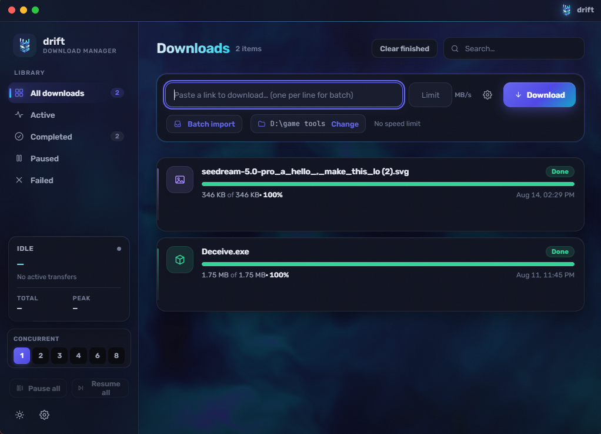

<p align="center">
  
</p>

<h1 align="center">drift</h1>

<p align="center">
  <b>Fast, modern download manager</b><br/>
  Segmented downloads · Pause & resume · Beautiful UI
</p>

<p align="center">
  <a href="https://github.com/sajjadbzrn/drift/releases/latest"></a>
  
  
  
  <a href="https://driftapp.ir"></a>
</p>

---

<p align="center">
  
</p>

---

## ✨ Features

- **🚀 Segmented downloads** — split large files into up to 8 parallel connections
- **⏯ Pause, resume & auto-retry** — stop or continue anything, state survives restarts
- **🎚 Speed limits & queue** — cap one download or all, choose how many run at once
- **📋 Clipboard & batch paste** — copy a link and drift offers to grab it
- **🧩 Browser companion** — Chrome + Firefox extension hands downloads to drift
- **🌗 Dark & light themes** — switch anytime from Settings
- **🌐 English & فارسی** — full Persian RTL support with Vazirmatn font
- **🌌 Cosmic particle background** — Three.js backdrop with mouse parallax

## ⬇️ Download

Head to the [latest release](https://github.com/sajjadbzrn/drift/releases/latest) and grab the Windows installer.

Or visit [drift.ir](https://driftapp.ir) for more info.

## 🧩 Browser Extension

Install the drift companion extension for Chrome or Firefox. Every download is automatically handled by drift. See [`extension/README.md`](extension/README.md) for details.

## 💻 Development

```bash
bun install
bun run tauri dev      # full app (Rust backend + web UI)
```

### Tech Stack

[**Tauri 2**](https://tauri.app) · [**React 19**](https://react.dev) · [**TypeScript**](https://www.typescriptlang.org) · [**Three.js**](https://threejs.org) · [**Vite 7**](https://vitejs.dev)

## 📄 License

[MIT](LICENSE)

---

<p align="center">
  Made with care · <a href="https://driftapp.ir">driftapp.ir</a> · <a href="https://github.com/sajjadbzrn/drift">GitHub</a>
</p>
