<p align="center">
  
</p>

<p align="center">
  <a href="https://github.com/sajjadbzrn/drift/releases/latest"></a>
  
  
  
  
  <a href="https://drift.ir"></a>
</p>

<p align="center">
  <b>Free · Open source · No ads · In-app updates</b>
</p>

---

> **drift** splits big files across up to **8 parallel connections**, so you get
> the full speed your connection can carry — then pauses, resumes, retries and
> organizes the rest. It lives quietly in your tray, speaks English and
> فارسی (RTL), and looks genuinely good doing it (yes, there's a living
> particle-field background).

<p align="center">
  <a href="https://github.com/sajjadbzrn/drift/releases/latest"><b>⬇ Download for Windows</b></a>
  &nbsp;·&nbsp;
  <a href="https://github.com/sajjadbzrn/drift"><b>★ Star on GitHub</b></a>
  &nbsp;·&nbsp;
  <a href="https://driftapp.ir"><b>Visit driftapp.ir</b></a>
</p>

---

## ✨ Why drift?

Most "download managers" are slow, clunky, or buried in ads. drift is the
opposite: small, native, and obsessed with the details that make downloads
painless.

- **🚀 Segmented downloads** — large files are split into up to 8 parallel
  connections, with automatic fallback when a server doesn't support ranges.
- **⏯ Pause, resume & auto-retry** — stop or continue anything; state survives
  restarts. Dropped connection? drift retries with exponential backoff.
- **🎚 Speed limits & queue** — cap one download or all of them, choose how
  many run at once, and drag to reorder the queue.
- **📋 Clipboard, batch & deep links** — copy a link and drift offers to grab
  it. Paste many URLs (one per line), or hand links over with `drift://`.
- **🧩 Browser companion** — the Chrome + Firefox extension hands every
  download to drift automatically.
- **🌗 Dark & light, English & فارسی** — a full Persian RTL UI (Vazirmatn font,
  Persian digits), native notifications, tray support, and in-app updates.
- **🌌 It's beautiful** — a live Three.js "cosmic drift" backdrop (nebula,
  dust, constellation) with mouse parallax, that politely freezes for
  `prefers-reduced-motion` and pauses when the window is hidden.

## 📈 Why it feels instant

Segmented connections multiply your speed. The more the server allows, the
faster drift goes:

<p align="center">
  
</p>

> Real-world gains depend on the server and your connection. Files over 16 MB
> are split automatically; smaller ones download single-connection.

## 🧩 Browser companion (`extension/`)

A single Manifest V3 codebase for **Chrome and Firefox** that behaves like
IDM's extension.

1. **Install drift** — run the installer once; drift registers its native
   messaging host (`drift-host`) automatically.
2. **Add the extension** — install drift companion from your browser's store.
3. **Download without thinking** — every `http(s)` download lands in drift
   automatically. Right-click → _Download link with drift_ works too.

If drift isn't installed, browser downloads proceed untouched and the extension
only shows a small badge + an install suggestion, at most once a day. See
[`extension/README.md`](extension/README.md) for the full story.

## 🌗 Two looks, two languages

Both **dark and light** themes ship with the app — switch anytime from
_Settings → Appearance_. Full **Persian (فارسی) RTL** support is built in:
flip to Persian and the whole UI mirrors, switches to the Vazirmatn font, and
renders Persian digits.

## 🛠 Features at a glance

| Feature                            | Notes                                                |
| ---------------------------------- | ---------------------------------------------------- |
| Segmented downloads                | up to 8 connections for files > 16 MB, auto-fallback |
| Pause / resume / cancel            | state restored on restart                            |
| Per-download & global speed limits | plus concurrent-download cap                         |
| Auto-retry                         | exponential backoff                                  |
| Clipboard URL detection            | batch paste (one URL per line)                       |
| `drift://` deep links              | hand links from any app                              |
| Native notifications & tray        | close-to-tray, queue reordering                      |
| Browser extension                  | Chrome + Firefox, native messaging                   |
| English & Persian (فارسی)          | RTL layout, Persian digits                           |
| In-app updates                     | Settings → Updates + silent launch check             |
| Cosmic particle background         | Three.js, reduced-motion aware                       |

---

## 🚀 Get drift

- **Download the installer:** head to the
  [latest release](https://github.com/sajjadbzrn/drift/releases/latest) and grab
  the Windows (`-setup.exe`) installer.
- **Update in place:** no uninstall/reinstall — update from inside the app
  (_Settings → Updates_).
- **Website:** <https://driftapp.ir> — English at `/`, Persian at `/fa/`.

> NSIS installs with `installMode: currentUser`, so updates replace the app in
> place and preserve your settings and downloads.

---

## 💻 Development

```bash
bun install
bun run tauri dev      # full app (Rust backend + web UI)
# or, web UI only:
bun run dev            # http://localhost:1420 (Vite)
```

The frontend runs on `http://localhost:1420`; the Rust backend lives in
`src-tauri/`.

### Browser extension (development)

```bash
bun extension/icons/generate.mjs   # one-time icon generation
# Chrome:  chrome://extensions      → Load unpacked → extension/
# Firefox: about:debugging          → Load Temporary Add-on → extension/manifest.json
```

See [`extension/README.md`](extension/README.md) for setup, publishing, and
debugging details.

### Other scripts

```bash
bun run build       # type-check + production web build
bun run typecheck   # tsc --noEmit
bun run preview     # preview the production web build
```

### Tech stack

[**Tauri 2**](https://tauri.app) · [**React 19**](https://react.dev) ·
[**TypeScript**](https://www.typescriptlang.org) ·
[**Three.js**](https://threejs.org) · [**Vite 7**](https://vitejs.dev)

## 📦 Releasing a new version (in-app updates)

Users update drift from inside the app — no uninstall/reinstall required.

### One-time setup

1. **Signing keys** (already in `.keys/`):
   - `.keys/drift.key` — your private key. **Back it up, never commit it.**
   - `.keys/drift.key.pub` — embedded in
     `src-tauri/tauri.conf.json` → `plugins.updater.pubkey`.
2. **GitHub repo** — updates are fetched from
   `https://github.com/sajjadbzrn/drift/releases/latest/download/latest.json`
   (keep the repo **public**).
3. **Secret** — add the private key as a repo secret
   `TAURI_SIGNING_PRIVATE_KEY` (value = whole contents of `.keys/drift.key`).

### Every release

```bash
bun scripts/bump-version.mjs 0.4.0   # bumps package.json, tauri.conf.json, Cargo.toml
git add -A && git commit -m "Release v0.4.0"
git tag v0.4.0 && git push && git push --tags
```

The workflow (`.github/workflows/release.yml`) builds the native messaging host,
the NSIS installer, signs it, generates `latest.json`, and uploads everything.
Users see _"Update v0.4.0 is available"_ and update in place.

### Manual release (no GitHub Actions)

```bash
bun scripts/build-host.mjs                          # build drift-host for the bundle
bun run tauri build --bundles nsis                  # needs TAURI_SIGNING_PRIVATE_KEY
bun scripts/make-update-json.mjs --version 0.4.0 --owner <owner> --repo <repo>
```

Then upload `*-setup.exe`, `*.exe.sig` and `latest.json` to a GitHub Release (or
any host matching the endpoint in `tauri.conf.json`).

> The updater is only active in release builds — `tauri dev` skips the update
> check.

---

## 📄 License

Free and open source.

<p align="center">
  Made with care · <a href="https://drift.ir">drift.ir</a> · <a href="https://github.com/sajjadbzrn/drift">GitHub</a>
</p>
